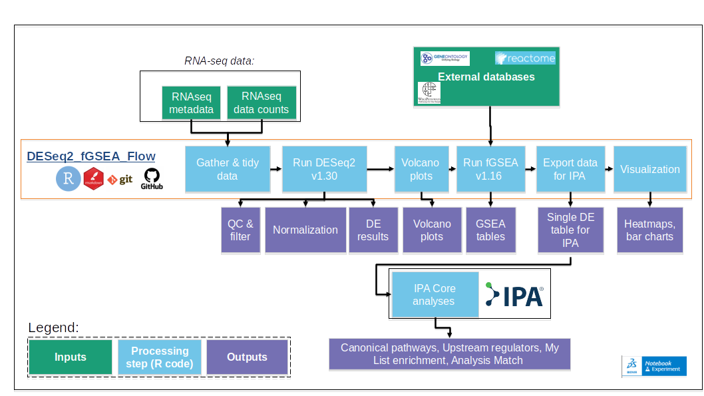
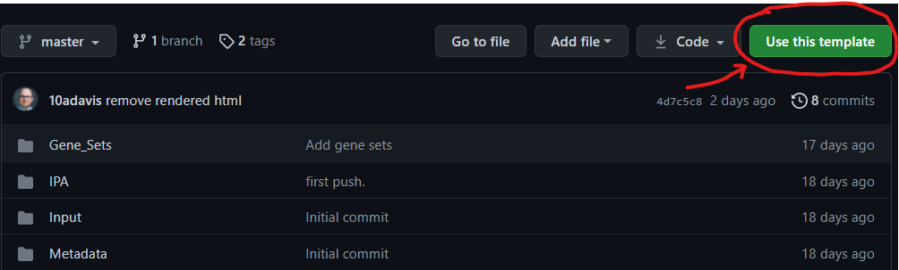

```{r, include = FALSE}
knitr::opts_chunk$set(
 collapse = TRUE,
 comment = "#>",
 out.width = "100%"
)

Rversion<-R.Version()
DESeq2_fGSEA_Flow_version<-"v1.0"
DESeq2_fGSEA_Flow_URL<-"https://github.com/10adavis/DESeq2_fGSEA_Flow /releases/tag/v1.0"
```

DESeq2_fGSEA_Flow `r DESeq2_fGSEA_Flow_version`

## Introduction
DESeq2_fGSEA_Flow has been produced to provide a standardized RNA-seq analysis pipeline.

This pipeline utilizes [DESeq2](https://bioconductor.org/packages/release/bioc/html/DESeq2.html) and [fGSEA](https://bioconductor.org/packages/release/bioc/html/fgsea.html) R packages to generate the following outputs:

-   Normalized count data
-   Quality control including metrics and plots
-   Differentially expressed genes (with statistics) between treatments/conditions
-   Visualization of DE results as volcano plots
-   Gene set enrichment results using the fGSEA package

DESeq2_fGSEA_Flow was developed to automate these analyses in a logical and fully reproducible manner.

To support the reproducibility of these analyses, this pipeline employs literate programming using [Rmarkdown(Rmd)](https://rmarkdown.rstudio.com/) and full R package dependency management using the [renv](https://rstudio.github.io/renv/articles/renv.html) package.



By default this pipeline will run on the example RNA-seq data in the [test_data](test_data) folder.

This data consists of RNA-seq data generated in the following study: [Interferon Receptor Signaling Pathways Regulating PD-L1 and PD-L2 Expression. A. Garcia-Diaz, et al. 2017. Cell Reports](https://www.cell.com/cell-reports/fulltext/S2211-1247(17)30525-9?_returnURL=https%3A%2F%2Flinkinghub.elsevier.com%2Fretrieve%2Fpii%2FS2211124717305259%3Fshowall%3Dtrue#secsectitle0035) and deposited on GEO, here: [GSE96619](https://www.ncbi.nlm.nih.gov/geo/query/acc.cgi?acc=GSE96619).

It is expected that this pipeline will be run on user provided data, in an iterative manner, with the user modifying the Rmarkdown scripts in folder [R_Scripts](R_Scripts).To do so, the user needs to input 1) Raw count data and 2) Associated sample metadata. It is expected that the user has a thorough understanding of RNA-seq and DESeq2 [M. Love, W. Huber, S. Anders. Genome Biology. 2014](https://genomebiology.biomedcentral.com/articles/10.1186/s13059-014-0550-8).

## Reasons to use RNAseq_GSEA_Flow:

1.  Run differential gene expression analysis on RNA-seq data using DESeq2, which is one of the most commonly used methods in bioinformatics.
2.  Quickly understand biological changes in your data, by running fGSEA, a popular R packages that performs fast, pre-ranked gene set enrichment analysis.
3.  Easily and quickly upload your own RNA-seq count data and sample metadata (drag and drop to the Input folder).
4.  Reminds you to capture essential metadata, in a consistent format, in this readme file - simply fill in the blanks in the pre-drafted report below.
5.  Can be run on a typical PC, on most operating systems, including Windows, Mac, and Linux, for free.
6.  Developed and shared as a fully open source, version controlled repository using GitHub, the most popular code hosting platform for version control and collaboration.
7.  Analyses can be quickly and easily reproduced by any other user when used in conjunction with git and GitHub. 
8. Automatically export the results as a single file for quick upload to Ingenuity Pathway Analysis (IPA) as a single dataset.

## Requirements:

-   `r Rversion$version.string`
-   [RStudio v1.4 or greater](https://www.rstudio.com/products/rstudio/)
-   [pandoc](https://pandoc.org/installing.html)

In addition, the user must install the following R packages:

-   rmarkdown_2.9
-   knitr_1.33

## Installation

This pipeline is deployed as a github repository template. To apply this pipeline to your particular experiment, one should first create a new repository using this template.



After creating a new Rproj using this template, the first required step is to install the R dependencies required to run the analysis (written in the .Rmd files in R_scripts). To do so, execute the following command in your R environment.

```{r eval=FALSE, message=FALSE, warning=FALSE}
renv::restore()
```

This will automatically install the packages required to run this analysis. By doing this, one will be able to execute the analysis using the same R packages (and the same versions) each time. Note that this will only need to be run once. If you require additional packages, or need to update the associated packages, be sure to execute the following command to update the [renv.lock](renv.lock) file:

```{r eval=FALSE, message=FALSE, warning=FALSE}
renv::snapshot()
```

### Modifying input datasets and setting DESEq2 design:

By default this pipeline will run on the example RNA-seq data in the [Example_data](Example_data) folder.

In order to run this pipeline on your data please add your counts and metadata (both as .csv files) to the [Input](../Input) folder. For a more detailed description of the file formatting requirements, see the instructions in [1.03_Gather-and-Tidy-Data.Rmd](R_scripts/1.03_Gather-and-Tidy-Data.Rmd). One will have to modify the directory paths to the counts and metadata files in [1.03_Gather-and-Tidy-Data.Rmd](R_scripts/1.03_Gather-and-Tidy-Data.Rmd).

The user will also have to specify the design of the DESeq2 model (in [2.03-DESeq2.Rmd](R_scripts/2.03-DESeq2.Rmd)) which includes specifying the factors of interest. For example, the default model includes a simple multifactor design, where we measure the effect of the Treatment, controlling for the subject effect.

```{r eval=FALSE, message=FALSE, warning=FALSE}
dds <- DESeqDataSetFromMatrix(countData = counts, colData = metadata, design = ~ subject + group)
```

The user will also have to specify the specific contrasts that they want to perform. By default the model runs 1 comparison: "anti_PDL_treated_tumor" vs "baseline_tumor"

To extract results for your particular dataset, modify/add these comparison\_ variables. Each comparison should be set to a variable (e.g., comparison_1), which equals a character vector, consisting of 3 character strings:

1.  The first string needs to correspond to the factor in design formula
2.  The name of the numerator level for the fold change
3.  The name of the denominator level for the fold change.

```{r eval=FALSE, message=FALSE, warning=FALSE}
comparison_1<-c("Treatment", "anti_PDL_treated_tumor", "baseline_tumor")
# The comparisons then need to be merged into a "list"
comparisons<-list(comparison_1)
```

### Capturing metadata:

Finally, the user is highly encouraged to fill in the details for their particular experiment/analysis, including at a minimum the information included below. The user is also encouraged to delete this introduction to the template/pipeline, and start the readme with the title of their analysis, followed by the Overview section below.

## Overview

This directory contains an analysis of....

The experiments were performed by \_\_\_\_\_\_ in the lab of \_\_\_\_.

The full analysis for this study can be found on\_\_\_\_\_

This analysis was version controlled as a GitHub repository, and can be accessed at the following url . Updates to this analysis will be tracked at the this location. For access to this repository, please reach out to \_\_\_\_\_\_.

## Lead contact(s):

-   [Andrew J. Davis, PhD: 88adavis\@gmail.com](mailto:88adavis@gmail.com)
-   ....

## Metadata:

Metadata associated with this analysis can be found in the [Metadata](Metadata) folder. Note that the contents of this folder will not be tracked by the remote repository by default (these files tend to be large to store on GitHub). To track the contents of this folder, one must remove the line "/Metadata/" from the [.gitignore](.gitignore) file.

## Input Data

The input data for this analysis was derived from the study titled "Interferon Receptor Signaling Pathways Regulating PD-L1 and PD-L2 Expression" by Garcia-Diaz et al., published in *Cell Reports* in 2017. This dataset, available under GEO accession [GSE96619](https://www.ncbi.nlm.nih.gov/geo/query/acc.cgi?acc=GSE96619), 
includes transcriptomic data from melanoma biopsies collected pre- and post-anti-PD-1 treatment. 
The study utilized paired-end RNA sequencing to investigate the interferon gamma-JAK1/2-STAT1-IRF1 axis and its role in regulating PD-L1 and PD-L2 expression. 
The dataset provides a comprehensive view of the transcriptional changes associated with anti-PD-1 therapy, making it a valuable resource for understanding immune checkpoint regulation and therapeutic response.

## Analysis pipeline:

1.  In [1.03_Gather-and-Tidy-Data.Rmd](R_scripts/1.03_Gather-and-Tidy-Data.Rmd), one reads in the raw counts and metadata.
2.  In [2.03-DESeq2.Rmd](R_scripts/2.03-DESeq2.Rmd), one uses the DESeq2 R package to perform QC and exploratory analysis of the raw count data. One then uses DESeq2 to perform differential gene expression analysis.
3.  In [2.05-Volcano-Plots.Rmd](R_scripts/2.05-Volcano-Plots.Rmd), one generates volcano plots for each desired comparison.
4.  In [3.03-GSEA.Rmd](R_scripts/3.03-GSEA.Rmd), one performs Gene set enrichment analysis (GSEA) using the fgsea R package against gene pathways/lists from GO, Reactome, and Wikipathways for each of the comparisons.
5.  In [4.03-Export_to_IPA.Rmd](R_scripts/4.03-Export_to_IPA.Rmd), one tabulates the DE results for an overall summary of the number of DEGs. ONe also generates and exports a table that can be uploaded into IPA for a Core Analysis.
6.  In [5.03-Gene_Heatmaps.Rmd](R_scripts/5.03-Gene_Heatmaps.Rmd), one generates a heatmap of the users favorite genes. By default the script plots scaled expression of a few select genes.

## Mechanics:

To run this analysis, first create/clean the results output folder by running the codes in [95_Make_Clean.Rmd](). Subsequently, run the code chunks in [99_Run_All.Rmd](R_scripts/99_Run_All.Rmd). This will run the Rmarkdown (.Rmd) files containing the actual code for this analysis in numerical order (i.e., 1.03_Gather-and-Tidy-Data.Rmd, followed by 2.03_Downstream_Analysis.Rmd). Note that one must modify the variable "files_in_r\_to_run" in [99_Run_All.Rmd](R_scripts/99_Run_All.Rmd) if one edits or add/deletes filenames of .Rmd scripts associated with this analysis.

Running [99_Run_All.Rmd](R_scripts/99_Run_All.Rmd) will also render html files of each .Rmd file, which will be saved to the results folder, making useful reports of this analysis. Finally, this README.Rmd files will also be knitted to an html file, as well as a markdown (.md) file, in the working directory of this repository. This markdown file makes for easy viewing on GitHub, and acts as the "home page" for this repo.

## Output:

The resulting output files were saved to the [Results](Results) folder in this repository. Note that the contents of this folder will not be tracked by the remote repository by default (these files tend to be large to store on GitHub). To track the contents of this folder, one must remove the line "/Results/" from the [.gitignore](.gitignore) file.

```{r, echo=FALSE}
list.files(path="Results")
```

## IPA:

Results from this experiment ([IPA/Merged_Treatment_Comparisons_DESeq2_Results.csv](IPA/Merged_Treatment_Comparisons_DESeq2_Results.csv)) were uploaded into IPA, under project "WWWWWW". The Dataset is titled: "XXXXXX" and the Core Analysis is titled: "ZZZZZ".

The resulting output files were saved to the [IPA](IPA) folder in this repository. Note that the contents of this folder will not be tracked by the remote repository by default (these files tend to be large to store on GitHub). To track the contents of this folder, one must remove the line "/IPA/" from the [.gitignore](.gitignore) file.

```{r, echo=FALSE}
list.files(path="IPA")
```

## Presentations_Reports

Presentations and reports shared with other members of our team are stored in [Presentations_Reports](Presentations_Reports). Note that the contents of this folder will not be tracked by the remote repository by default (as these files tend to be large to store on GitHub). To track the contents of this folder, one must remove the line "/Presentations_Reports/" from the [.gitignore](.gitignore) file.

## Summary of results:

### Study Design and Input Samples

This analysis was conducted using RNA-seq data from melanoma biopsies collected both before and after anti-PD-1 treatment. 
The paired design of the study allowed for the direct comparison of transcriptional changes within the same patients, providing a robust framework for identifying treatment-induced effects. 
The dataset included samples from multiple patients, ensuring that the findings are representative of a broader population.

### Discussion

The results of this analysis highlight the multifaceted impact of anti-PD-1 therapy on the tumor microenvironment. 
The enrichment of immune-related pathways, such as complement activation, underscores the role of immune system activation in mediating therapeutic effects. 
Additionally, the observed changes in neural signaling pathways suggest potential crosstalk between the nervous system and tumor biology, which warrants further investigation. 

Finally, the remodeling of the extracellular matrix may facilitate immune cell infiltration, enhancing the overall anti-tumor response.

These findings not only provide insights into the mechanisms of action of anti-PD-1 therapy but also identify potential biomarkers and therapeutic targets for improving treatment outcomes.


## To do list:

1.  ...

## Template used:

This repository was generated from [10adavis/DESeq2_fGSEA_Flow `r DESeq2_fGSEA_Flow_version`](https://github.com/10adavis/DESeq2_fGSEA_Flow).

### Session information

```{r session_info}
sessionInfo()
```

This document was processed on: `r Sys.Date()`.
